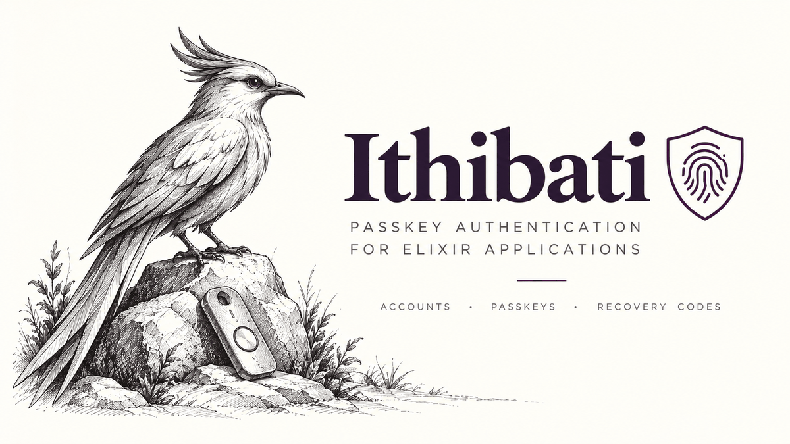

# Ithibati



Passkey authentication for Elixir applications: accounts, WebAuthn credentials, recovery codes
and revocable sessions. It has no opinion about what an account may do. The web half is optional
and built for Phoenix.

[Swahili, *ithibati*](https://en.wiktionary.org/wiki/ithibati): proof, evidence. In WebAuthn's own vocabulary, attestation.

## What it provides

- Passkey registration and authentication through [WebAuthn and `wax_`](https://hex.pm/packages/wax_).
- Passkey management: add another passkey, list, rename and revoke existing ones.
- Single-use recovery codes for signing in when a passkey is unavailable.
- Revocable server-side sessions. The browser holds a secret; the database stores its digest.
  Signing out revokes the session in the database.
- Invitation tokens, expiry and redemption, plus a way to claim the first account on an empty
  instance. Both open registration and invitation-only applications are supported.
- Changeset helpers and composable `Ecto.Multi` steps. Create an account, its first passkey and
  its recovery codes in one transaction, alongside your own application changes.

## What your application owns

You keep your account schema and `users` table. Ithibati adds the fields and associations it
needs through a schema macro. You choose the identifier field: a username, an email address or
another format your application accepts.

Your application defines roles, memberships and permissions. After Ithibati verifies a passkey,
your handler decides whether to create a session and where to send the person next.

You also build the registration, sign-in and recovery-code pages. Ithibati supplies the Phoenix
endpoints and browser integration; the examples show how to connect them to a working interface.

For invitations, you own the invitation table and decide what accepting one grants. Your
application can deliver existing links with `Ithibati.InvitationMail`, using its own content
callback and mailer. See [email delivery](docs/invitations.md#email-delivery). Choosing an email
address as an account identifier does not by itself verify ownership of that address. Rate
limiting for registration, sign-in and recovery is the application's responsibility.

## Requirements

- Elixir 1.18 or newer.
- PostgreSQL, SQLite or MySQL and an Ecto repo. See [database configuration](docs/configuration.md#databases)
  for adapter settings and transaction requirements.
- For the optional web integration: Phoenix 1.8, LiveView 1.1 and Plug. They form one web layer;
  the identity core can be used without them.

## Getting started

Add the dependency:

```elixir
{:ithibati, "~> 0.1"}
```

Then follow [Getting started](https://hexdocs.pm/ithibati/getting_started.html). It walks a fresh
Phoenix application through configuration, the account schema and migration, an auth handler,
routes, browser integration and pages for signing in and saving recovery codes.

The following excerpts show how the pieces fit together. The guide supplies the surrounding
modules, imports and configuration.

Your account schema names its identifier and validation format:

```elixir
alias Ithibati.Schema.Identifier
alias Ithibati.Schema.User

use User, identifier: :username, format: Identifier.username_format()
```

Your router mounts the registration, authentication and recovery endpoints:

```elixir
ithibati_routes handler: MyAppWeb.Auth, rp_name: "MyApp"
```

Your handler receives the verified account. Here it creates a session and returns a redirect:

```elixir
@impl true
def authenticate(conn, account),
  do: {:ok, conn |> Gate.log_in(account) |> json(%{redirect: "/inside"})}
```

A LiveView starts sign-in by sending an event to the browser hook:

```elixir
def handle_event("sign-in", _params, socket),
  do: {:noreply, socket |> assign(error: nil) |> push_event("ithibati:authenticate", %{})}
```

The browser lets the person choose a passkey for your site. They do not need to enter a username
first. Registration asks for an identifier to create the account.

Once the pieces are in place, run `mix ithibati.doctor` to check configuration, database tables,
indexes and handler wiring. The guide also shows how to protect a page and sign out.

## Without Phoenix

The identity core exposes registration and authentication as ordinary function calls. Your
integration supplies the relying-party ID and origin, retains the challenge between requests,
and decides what to issue after verification.

For browser clients, `priv/static/ithibati.js` exports `register` and `authenticate` as plain
JavaScript functions. The LiveView hook wraps those same functions.

[Registering and signing in](https://hexdocs.pm/ithibati/ceremonies.html) covers the Phoenix
integration and direct use of the core, including the boundary where a native client or another
web framework connects.

## Examples and documentation

Three complete Phoenix applications show the supported registration flows:

- [Open registration](https://github.com/oliverandrich/ithibati/tree/main/examples/open_registration):
  anyone who reaches the page can choose a username and register a passkey.
- [Invitation only](https://github.com/oliverandrich/ithibati/tree/main/examples/invitation_only):
  the first account claims the instance; subsequent accounts need an invitation link.

- [Email registration](https://github.com/oliverandrich/ithibati/tree/main/examples/email_registration):
  one email address identifies the account and receives the registration link; a local mailbox
  preview lets you follow the link and create a passkey without real email delivery.

CI compiles all three applications, runs their tests and exercises them in a browser.

The [documentation](https://hexdocs.pm/ithibati) includes guides for:

- [Configuration and schemas](https://hexdocs.pm/ithibati/configuration.html).
- [Registration and sign-in](https://hexdocs.pm/ithibati/ceremonies.html).
- [Adding and managing passkeys](https://hexdocs.pm/ithibati/passkeys.html).
- [Recovery codes](https://hexdocs.pm/ithibati/recovery.html).
- [Invitations and the first account](https://hexdocs.pm/ithibati/invitations.html).
- [Checking your setup with `ithibati.doctor`](https://hexdocs.pm/ithibati/doctor.html).
- [Credo checks for consuming applications](https://hexdocs.pm/ithibati/credo.html).

[CHANGELOG.md](CHANGELOG.md) records changes between releases.

## Licence

MIT. See [LICENSE](LICENSE).
